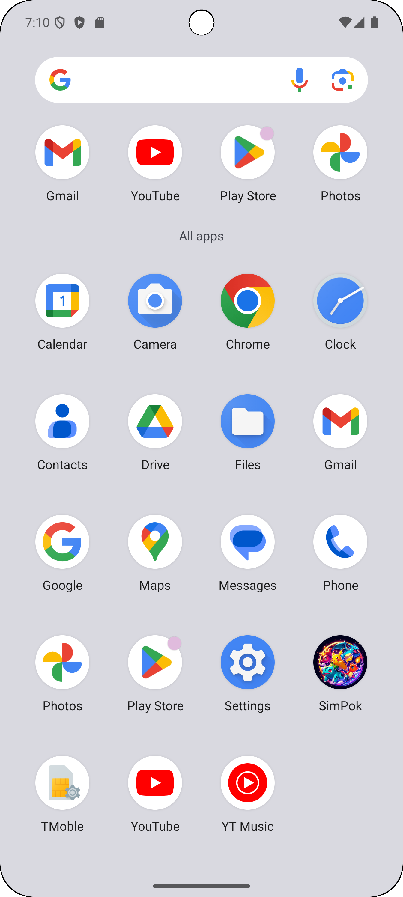
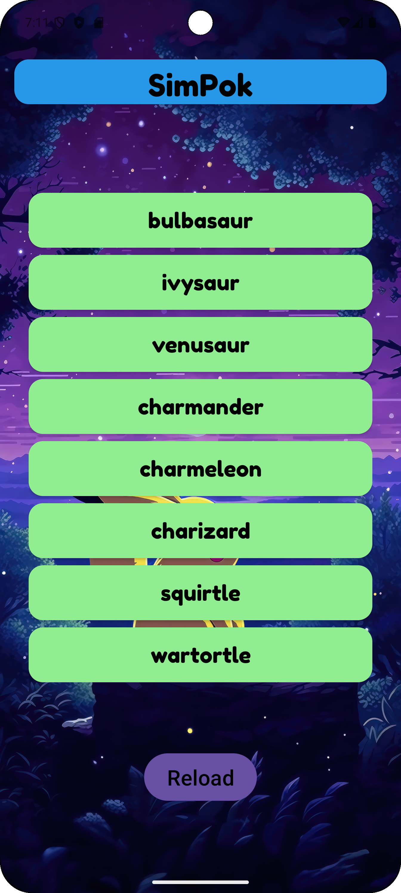

# Mobile App Development

## Description
This app is a simple introduction test to mobile development created for the Software Development Skills: Mobile [LUT university](https://www.lut.fi/en)  course. I created a pokemon app that loads a list of 8 pokemon using the Pokemon API. The user can click on a pokemon name to see an animated gif of the pokemon that opens in a different view.
Also I added a button to load another 8 pokemons.

## Features
- Load 8 pokemons
- Click on a pokemon name to see an animated gif of the pokemon
- Load another 8 pokemons clicking the "Reload" button

## Installation
1. Clone the repository
2. Open the project in Android Studio
3. Run the project

or install the apk file in the `app/release` folder

## Usage
1. Open the app

2. Click on a pokemon name to see an animated gif of the pokemon

3. Click on the "Reload" button to load another 8 pokemons

## References
* [Blur Image Tool](https://pinetools.com/blur-image)
* [chatGPT](https://chat.openai.com/)
* [Pokemon API](https://pokeapi.co/)